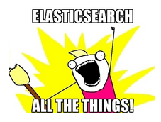

page_title: Elasticsearch setup for Rails Apps
page_author: Brittany Martin
page_description: Knowledge base article to instruct users on how they can implement elasticsearch with Ninefold bare servers for their Rails apps 
page_keywords: elasticsearch solr search docker servers rails 

## Setup Elasticsearch 

*** 
Note: You will have to enable Ninefold Net using [this guide](http://help.ninefold.com/networking/ninefold_net/) before you deploy your Rails app and server. 
***

#### Why Elasticsearch? 

Want to search all the things? Elasticsearch is the way to go! Elasticsearch is a flexible and powerful open source, distributed, real-time search and analytics engine. Elasticsearch gives you the ability to move easily beyond simple full-text search. At Ninefold, ES powers our robust logging search.  

#### Elasticsearch and Ninefold

Ninefold currently doesn’t have Elasticsearch built into the Rails hosting infrastructure. Never fear -- you can still stick with Ninefold and get it on with an Elasticsearch image on a Docker templated Ninefold server.

***
Note: Ninefold's bare servers are an unmanaged service, and this guide is our way of helping you utilze Elasticsearch within Ninefold's environment.
***

#### Introducing Docker

[Docker](https://docker.com/) is an open-source project that automates the deployment of applications inside software containers, providing that way an additional layer of abstraction and automatization of operating system–level virtualization on Linux. It’s super easy to deploy a Docker template on one of Ninefold’s bare servers.

If you are new to Docker, we suggest running through the examples in the [Docker tutorial](https://www.docker.com/tryit/).

#### Docker Server

Sign into Ninefold and instead of deploying a new app, deploy a server. We recommend deploying at least 2GB on the Ninefold bare server. 

Select Ubuntu as the OS and then choose Docker in the server deployment wizard. We will automatically setup Ubuntu 14.04 LTS with Docker for you. 

 

#### Elasticsearch Image

We add the Elasticsearch Docker image for you. No need to track it down on the interwebs. If you are curious, you can check out the image [here](https://registry.hub.docker.com/u/dockerfile/elasticsearch/).

#### Config Rails App 

There is a great [tutorial](http://www.sitepoint.com/full-text-search-rails-elasticsearch/) for adding Elasticsearch to your Rails app. Navigate right to the ‘Integrate Elasticsearch’ section. 

You will want to create an elasticsearch.yml file in the app's config folder. 

Example elasticsearch.yml: 

	development:
  	 host: localhost:9200

	staging:
  	 host: ENV["ELASTICSEARCH_URL"]
	
	production:
  	 host: ENV["ELASTICSEARCH_URL"]

Since you have configured the Elasticsearch service on your Docker server, it is time to point the Rails app to it. 

Navigate to your App in Ninefold Dashboard. Go to __YourApp__ > __Configuration__ > __Environment Variables__ to add in the Elasticsearch env var that has been configured in the app. 

Example:

	ELASTICSEARCH_URL=http://111.11.11.11:9200
	
Redeploy your app, and you will be delivering top-notch search to your customers. 

#### Alternative: Solr	

Is Solr the search solution of your choice? These instructions can be followed to setup Solr as well except the [Solr image](https://registry.hub.docker.com/u/makuk66/docker-solr/) will need to be downloaded to the Docker container. 