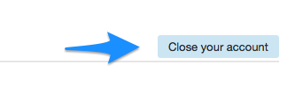

page_title: How to close your account
page_description: How to close your account
page_keywords: close account

## How to close your account

You can do so by visiting your [account billing page](https://portal.ninefold.com/account/billing_details).  At the bottom of the page you will see a button to close your account.

You will also be presented with a popup dialog asking you to confirm your action.  Once you confirm, your account will be removed and your billing will be shut off.
