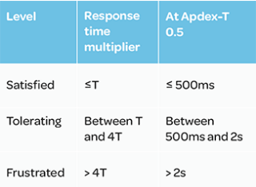

page_title: Apdex to measure user satisfaction
page_description: Apdex to measure user satisfaction
page_keywords: apdex

## What is Apdex?

[Apdex](http://apdex.org) is a way of measuring the satisfaction of your users with your website’s response times. It is designed to provide a framework for determining whether or not your application is performing to the level that you — and more importantly your users — expect.

Apdex can be calculated from the time it takes to completely load the page, and this is often a very important way of calculating it. Ninefold however calculates the Apdex based on how long it takes for your application to respond to requests. This forms the basis for the time it takes for the browser to load the page.

To calculate the Apdex in our tests, we measured the time it took for a test example (Spree) to respond to requests from simulated users. We then classified these user into buckets defined by the Apdex formula: Satisfied users, Tolerating users and Frustrated users.

These buckets are defined using a threshold, called Apdex-T. Apdex-T can be defined to whatever number makes sense for a given application. The rule that should be followed is that all responses received in less than Apdex-T satisfy the user.

The buckets are then divided as follows:

To calculate the Apdex, we then apply the following formula:

