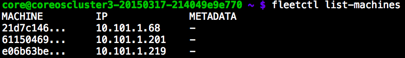

page_title:       How to create a CoreOS Server
page_author:      Shaun Domingo
page_description: Knowledge base article to instruct users on they can deploy a CoreOS server with Docker installed
page_keywords:    CoreOS server container docker

## Create a CoreOS server

[CoreOS](https://coreos.com) is a minimalistic linux distribution that has been written to run distributed, scalable applications and services with high resiliency.

Deploying CoreOS on Ninefold is simple thanks to our CoreOS template and [user data](user_data.md) functionality.

The CoreOS template is set up based on the Cloudstack OEM overlay, which means during startup the cloud-config settings will be read from user data and appropriate service initialisation will take place.

You can't log on to CoreOS without SSH keys, so make sure you set up your [ssh keypair](ssh_keys.md) on Ninefold or you won't be able to get on to any machine in your CoreOS cluster.

From the Ninefold Dashboard click to create a [New Server](https://portal.ninefold.com/servers/new). Ensure these components are selected when deploying your CoreOS instance:

* Memory & CPU: go for a minimum of 2GB-X2 (if you go lower, the OS may not boot). Choose a compute size that's suitable for your needs. You can resize at any time, but we advise keeping all CoreOS machines in a cluster the same size.
* Image: CoreOS (we only supply the latest stable version)
* In Additional options, select and specify [user data](user_data.md)
  * Regardless of whether you intend to set up a CoreOS cluster, you'll need a [unique discovery URL](https://coreos.com/docs/cluster-management/setup/cluster-discovery/) which will allow machines in the cluster to communicate
  * In the [user data](user_data.md) text area specify your [cloud-config](https://coreos.com/docs/cluster-management/setup/cloudinit-cloud-config/). Below we've provided an example that will get you running with etcd, fleet and docker. Remember to replace the etcd discovery attribute with the actual CoreOS discovery URL.
```
#cloud-config

coreos:
  update:
    reboot-strategy: best-effort
  etcd:
    discovery: https://discovery.etcd.io/youruniquediscoveryurltokenhere
    addr: $private_ipv4:4001
    peer-addr: $private_ipv4:7001
  fleet:
    public-ip: $private_ipv4
  units:
    - name: etcd.service
      command: start
    - name: fleet.service
      command: start
```

Click Deploy and the server is up and running in just a couple of minutes with 80Gb of attached local disk. You'll be in a great spot if you've added [ssh keys](ssh_keys.md) because you'll be able to SSH straight onto your machine.

`ssh core@(publicipaddress)`

If you forgot to add an [SSH key](ssh_keys.md), you can do so at any time.

## To add additional storage

* Click on the Storage link against your CoreOS machine in the Ninefold portal
* Use the New disk form to add a new disk
* SSH onto your VM, and find /dev/xvdb (increment b by 1 letter for each additional volume)
* To add additional disk to CoreOS or Docker, follow this CoreOS guide on [mounting storage](https://coreos.com/docs/cluster-management/setup/mounting-storage/).

## Doing something with CoreOS

You've got a server running, but that's not much without doing something with it. There are many examples on the internet and we prefer to leave it to the experts, but we'll get you up and running with something that will make you cheer.

We'll utilise fleet. Fleet is like a distributed init system. You interact with it in a simple and intuitive way by submitting, stopping and starting units via [fleetctl](https://coreos.com/docs/launching-containers/launching/fleet-using-the-client/).

Fleetctl is a command that talks via API and helps you control executable units across your cluster. You can use _fleetctl_ on your Ninefold CoreOS server or you can run it from your local machine and control a remote cluster.

`Note: you should run the same version of fleetctl on your local machine as you do on your server. fleetctl --version will help pave the way.`

### Install fleet on your local OSX (darwin) or linux (amd64) computer

You could use fleetctl on the Server you've created, but that would be no fun. You can control your fleet cluster right from the comfort of your own computer. Fleet makes this really simple, it just tunnels through an SSH connection to make it happen.

* Visit [https://github.com/coreos/fleet/releases](https://github.com/coreos/fleet/releases). You'll need to find the appropriate binary download for the fleet version on your CoreOS server `fleetctl --version`. Download it and install it to a location on your machine that's on your path.
* Ensure you've started your SSH user agent: `eval $(ssh-agent)`
* Add your private key to your agent: `ssh-add` (you will need to enter your private key password if you've set one)
* From your terminal `export FLEETCTL_TUNNEL=(yourserverpublicipaddress)`

Run `fleetctl list-machines` and fleet should come back with a list of machines currently registered in your cluster.



### Get something running on your cluster

In this example we'll use one of CoreOS' examples of running an apache frontend in [high availability](https://coreos.com/docs/launching-containers/launching/launching-containers-fleet/) mode.

Fortunately, by default we open the HTTP firewall port server's IP address, so you won't need to fiddle with your Ninefold server at all.

To get apache up and running:

* Create yourself a unit template file anywhere on your machine (call it apache@.service):

```
[Unit]
Description=My Apache Frontend
After=docker.service
Requires=docker.service

[Service]
TimeoutStartSec=0
ExecStartPre=-/usr/bin/docker kill apache1
ExecStartPre=-/usr/bin/docker rm apache1
ExecStartPre=/usr/bin/docker pull coreos/apache
ExecStart=/usr/bin/docker run -rm --name apache1 -p 80:80 coreos/apache /usr/sbin/apache2ctl -D FOREGROUND
ExecStop=/usr/bin/docker stop apache1

[X-Fleet]
Conflicts=apache@*.service
```

* Submit your new apache template to fleet: `fleetctl submit apache@.service`
* `fleetctl start apache@1`
  * If you have more than one machine in your fleet cluster, keep running the previous command, incrementing the number after the @ sign by one each time. If you exceed the number of machines in your cluster, the service will bank up waiting for a free machine to run on.

Once you're done, hit any of your machine's public ip addresses from your web browser (http://_youripaddress_), and walla, apache will tell you _It works!_.

How does it work? Well the unit file you submitted and started runs a standard coreos/apache docker container, and exposes it on public port 80.

For comprehensive information on interacting with units, see [CoreOS's excellent guide](https://coreos.com/docs/launching-containers/launching/fleet-using-the-client/).

CoreOS is such a step forward when it comes to deploying distributed, scalable applications and services. We know you'll love it. While it does take a bit of getting used to, you're surely hooked after getting this simple example running.
